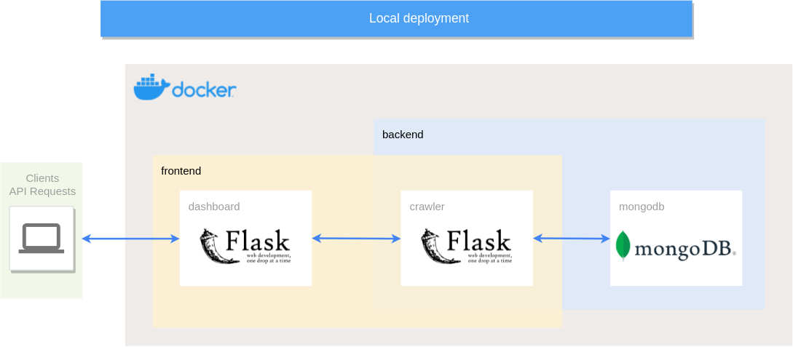
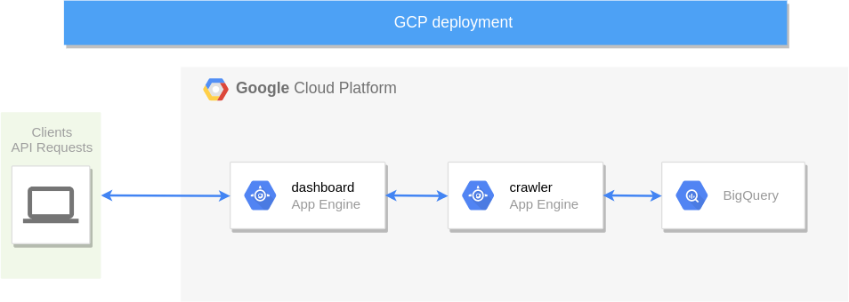
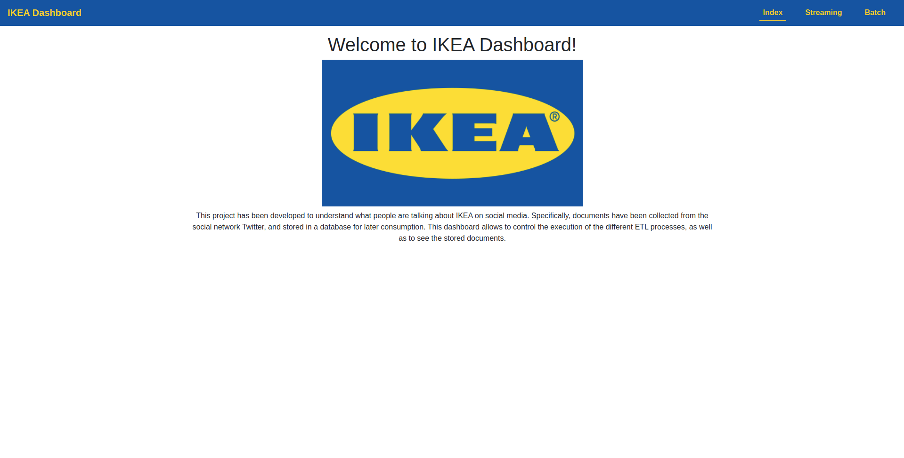
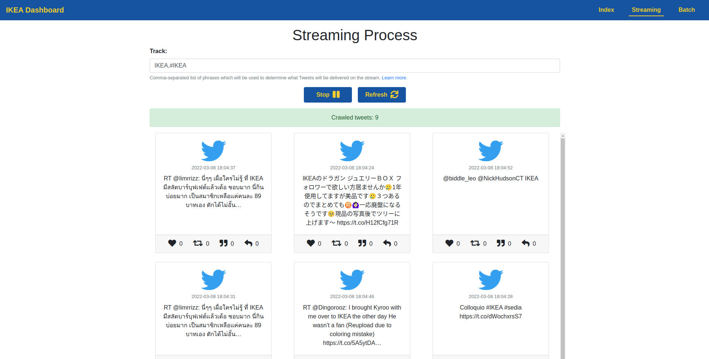
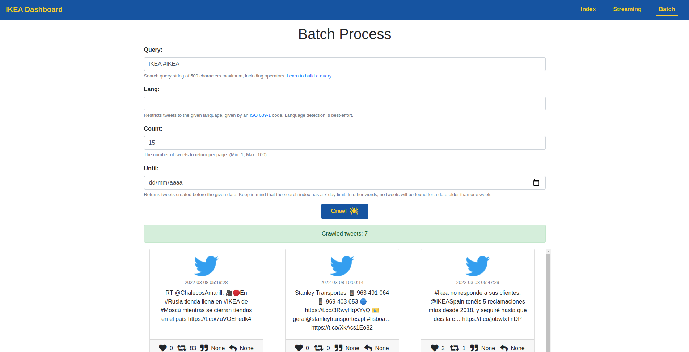

# **IKEA Dashboard**

This project has been developed to understand what people are talking about IKEA on social media. Documents have been collected from the social network Twitter, and stored in a database for later consumption. Data can be crawled whether on **streaming** or **batch** mode. Also, depending on the environment the project is deployed on, two different database engines will be used: **MongoDB** (local deployment) and **BigQuery** (Google Cloud Platform deployment).

## **Authors**

 1. Luis Cristóbal López García

## **Data model**

Retrieved fields and the reasoning behind why they have been selected are:

 * **id:** tweet id assigned by Twitter, required to indetify it.
 * **created_at:** UTC time when the tweet was posted. Usefull for any time series study.
 * **text:** UTF-8 text of the tweet. Could be used for NLP projects such as clustering, topic modelling or any supervised learning classifier.
 * **lang:** indicates the language in which the tweet was written. Can be used to retrieve a single language in case of developing an NLP model.
 * **coordinates:** geographic location of the tweet reported by the user. It can be used to identify tweets associated with countries or even cities.
 * **source:** utility used to post the tweet. Could be useful for some initiatives.
 * **interactions:** number of user interactions with the tweet. Count of both favourites, retweets, quotes and replies have been collected. Overall, it represents the impact the tweet has had on its network.
 * **crawler:** field added by the ETL process. Indicates the type of crawler used to collect the tweet: "streaming" or "batch".

## **Local deployment**



This solution will be deployed locally using docker engine and docker-compose. A total of three containers will be deployed, each fulfilling a different function in the pipeline.

 * **dashboard:** this container is responsible for dealing with client requests. It wil communicate with the crawler to handle the execution of the different ETL process, and to recieve the data to be represented.
 * **crawler:** Flask app where the ETL logic is performed. Several endpoints have been exposed so that the execution can be controlled on an API-friendly way.
 * **mongodb:** document oriented NoSQL database service employed for the local implementation. It has been selected because the data being collected (tweets) are actually documents, so this solution will allow us to modify the data model if necessary without affecting the previously stored entries.

Two different networks have been created, `frontend` and `backend`. Crawler container is connected to both, while dashboard (`frontend`) and mongodb (`backend`) containers only have access to one of them. This allows that only the crawler container can access the database, so all the read and write requests are made through it.

Finally, mongodb data is stored on a mounted volume, allowing us to persist data between builds.

### **Deployment**

#### **0. Previous steps**

Before the project can be executed there are certain requirements and instructions that must be pleased.

 1. Docker and docker-compose need to be installed in the host system. Follow [this](https://docs.docker.com/compose/install/) link for more information about the process.
 2. User must have access to a Twitter Developer Account in order to collect data. V1.1 access will be used, so you will need an API_KEY, API_SECRET, ACCESS_TOKEN and ACCESS_TOKEN_SECRET.

#### **1. Modify environment variables**

File `.env` contains all the project environment variables. Here you can modify any deployment parameter according to your needs, and you will also have to fill the Twitter API keys you got in the previous step.

```
API_KEY=your-key
API_SECRET=your-key
ACCESS_TOKEN=your-key
ACCESS_SECRET=your-key
CRAWLER_HOST=crawler
CRAWLER_PORT=5000
CRAWLER_BASEURL=http://crawler:5000
DASHBOARD_HOST=dashboard
DASHBOARD_PORT=8080
MONGODB_DATABASE=ikeadb
MONGODB_COLLECTION=tweets
MONGODB_USERNAME=crawler
MONGODB_PASSWORD=ikea
MONGODB_HOSTNAME=mongodb
```

These environment variables will be passed to the containers upon build through the docker-compose definition.

#### **2. Build the project**

Open a terminal on the project's root folder and run:

```
docker-compose up --build
```

Note you may need to run the command as a `sudo` superuser depending on your configuration.

This process may take a while if you run the command for the first time. Once the process finishes, the project must be up and running and the services available in their corresponding endpoints.

#### **3. Services**

 * **dashboard:** http://0.0.0.0:8080
 * **crawler:** http://0.0.0.0:5000
 * **mongodb:** database can be accessed running the following commands

```
(host)      > docker exec -it mongodb bash
(container) > mongo -u admin -p root
(mongodb)   > use ikeadb
(mongodb)   > db.ikeadb.tweets.findOne()
```

## **Google Cloud Platform deployment**



If the project is deployed on GCP, a cloud-native solution has been designed. Employed services include:

 * **App Engine:** serverless solution to easily deploy both Flask applications.
 * **BigQuery:** Google DataWarehouse service.

A BigQuery table will contain crawled tweets. File `schemes/tweets_schema.json` shows the table schema meeting the proposed data model. Also, the table has been partitioned by `DAY` on the `created_at` field, and clustered by the `crawler` > `lang` fields. This will reduce the amount of data retrieved by each query, and hence the costs.

### **Deployment**

#### **1. Modify environment variables**

Again, we will need to set some environment variables before deploying the solution.

First of all, we need to set again the Twitter API keys on `crawler/app.yaml` file. You can also modify other variables as `BUCKETNAME`, `DATASET` or `TABLENAME`.

```
env_variables:
  APP_ENV: "prod"
  APP_DEBUG: "False"
  APP_PORT: "8080"
  BUCKETNAME: "ikea-interview-files"
  TABLENAME: "tweets"
  DATASET: "social_data"
  API_KEY: "your-key"
  API_SECRET: "your-key"
  ACCESS_TOKEN: "your-key"
  ACCESS_SECRET: "your-key"
```

Then, we must set the `CRAWLER_BASEURL` environment variable on `dashboard/app.yaml` so that the dashboard can reach the crawler. Depending on the project name and the region where the app engine is deployed, the value will follow the pattern `https://crawler-dot-PROJECTNAME.REGION.r.appspot.com`

```
env_variables:
  APP_ENV: "prod"
  APP_DEBUG: "False"
  APP_PORT: "8080"
  CRAWLER_BASEURL: "https://crawler-dot-ikea-interview.ew.r.appspot.com"
```

#### **2. Set permissions**

In a newly created project, the default App Engine service account will not have the required permissions to run our solution. In this step we will ensure that the service account (which follows the pattern `PROJECTNAME@appspot.gserviceaccount.com`) has the roles it needs:

 * App Engine Deployer
 * BigQuery Data Owner
 * BigQuery Job User
 * Storage Admin

```
gcloud projects add-iam-policy-binding $GOOGLE_CLOUD_PROJECT --member="serviceAccount:ikea-interview@appspot.gserviceaccount.com" --role="roles/appengine.deployer"
gcloud projects add-iam-policy-binding $GOOGLE_CLOUD_PROJECT --member="serviceAccount:ikea-interview@appspot.gserviceaccount.com" --role="roles/bigquery.dataOwner"
gcloud projects add-iam-policy-binding $GOOGLE_CLOUD_PROJECT --member="serviceAccount:ikea-interview@appspot.gserviceaccount.com" --role="roles/bigquery.jobUser"
gcloud projects add-iam-policy-binding $GOOGLE_CLOUD_PROJECT --member="serviceAccount:ikea-interview@appspot.gserviceaccount.com" --role="roles/storage.admin"
```

#### **3. Create a bucket and upload files**

The next step will be creating the project bucket where we will upload the table schema so that it can be retrieved when uploading new entries to BigQuery. Make sure that you use the same `BUCKETNAME` that you wrote in `crawler/app.yaml`.

```
gsutil mb -p $GOOGLE_CLOUD_PROJECT -l EU gs://ikea-interview-files
```

Now, we can upload the scheme file to the bucket.

```
gsutil cp schemes/tweets_schema.json gs://ikea-interview-files/schemes/
```

#### **4. Create dataset**

Although the table is created if necessary the first time the process is executed, we first need to create the dataset where it will be stored. Again, remember to provide the same `DATASET` name that you provided in the `crawler/app.yaml` file. 

```
bq --location EU mk --dataset $GOOGLE_CLOUD_PROJECT:social_data
```

#### **5. Deploy dashboard**

We first need to deploy the default service for App Engine, which is the dashboard. This is a pretty simple step, which can be performed by running:

```
cd dashboard/
gcloud app deploy
```

#### **6. Deploy crawler**

The final step is deploying the crawler service on App Engine. Again, let's run these commands:

```
cd ../crawler/
gcloud app deploy
```

#### **7. Services**

With this, we have our solution deployed in the Cloud. A working dashboard demo can be found in the following URL:

```
http://ikea-interview.ew.r.appspot.com/
```

## Dashboard preview







## License

Copyright © 2022

Licensed under the Apache License, Version 2.0 (the "License"); you may not use this file except in compliance with the License. You may obtain a copy of the License at:

```
http://www.apache.org/licenses/LICENSE-2.0
```

Unless required by applicable law or agreed to in writing, software distributed under the License is distributed on an "AS IS" BASIS, WITHOUT WARRANTIES OR CONDITIONS OF ANY KIND, either express or implied. See the License for the specific language governing permissions and limitations under the License.